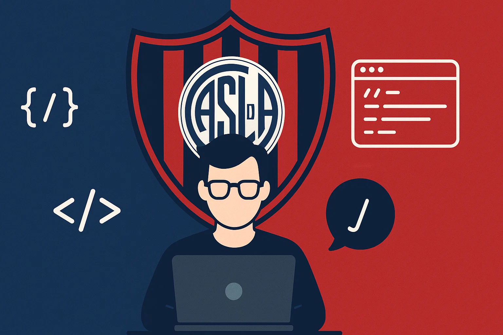

<!-- Intro -->
<h1 align="center">Hi, I'm Juan Balella 👋</h1>

  

  Curious mind • 4th-year Computer Engineering student (UBA) • Always learning by building

  <a href="https://www.linkedin.com/in/juan-balella84ab62239">LinkedIn</a> ·
  <a href="https://juanbalella20.github.io/Portfolio-Juan-Balella/">Portfolio</a> ·
  <a href="mailto:02balella@gmail.com">Email</a>

  
  

---

### About me
- 🧠 I learn by building: every project is a way to explore ideas, solve problems, and grow.
- 🤝 I value collaboration and clear communication—good software is a team sport.
- 🚀 I enjoy turning concepts into working solutions users can actually touch.
- 🎓 Currently pursuing my 4th year of Computer Engineering at UBA (actively enrolled).
- 🌍 Open to **freelance projects** and **junior IT roles**.

### What I'm focusing on right now
- Designing small, end-to-end apps to practice product thinking and clean code.
- Improving testing habits and project structure.
- Sharing progress publicly (notes, small writeups, and code).

---

### Toolbox I reach for
I keep my stack pragmatic and evolving. I prefer clear code, small iterations, and good DX.
- Versioning & workflow: **Git/GitHub**, issues, small PRs, meaningful commit messages
- Product & delivery mindset: documentation, reproducible environments, readable READMEs
- Testing & quality: **unit tests**, simple CI, incremental refactors

> If a tool helps me ship clearer code or learn faster, I’ll try it.

---

### GitHub at a glance

  
  

---

### How to reach me
- 💼 LinkedIn: <a href="https://www.linkedin.com/in/juan-balella84ab62239">/in/juan-balella84ab62239</a>  
- 🌐 Portfolio: <a href="https://juanbalella20.github.io/Portfolio-Juan-Balella/">Portfolio – projects & demos</a>  
- 📬 Email: <a href="mailto:02balella@gmail.com">02balella@gmail.com</a>

---

#### Notes
- If I rename my GitHub username in the future, I’ll update the Portfolio link accordingly.
- Repos are kept small and focused so they’re easy to read and run.

<!-- End -->

### ⚙️ &nbsp;GitHub Analytics

